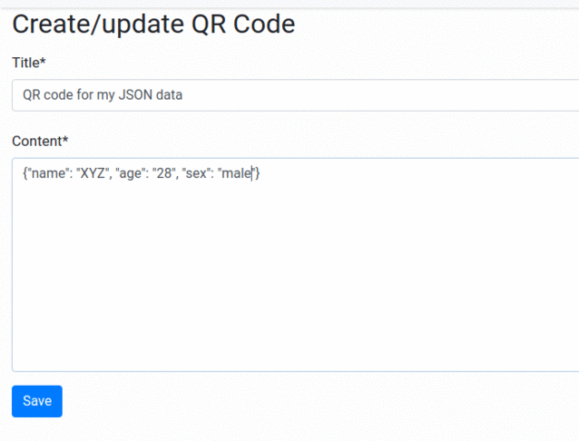

# Read/Write QR Code

This Django application has an implementation to read and write QR code of the given information. This is built with Python 3, Django 2 and few python libraries.
Below python libraries used to encode and decode QR code.

##### To Read
https://pypi.org/project/pyzbar/

##### To Write
https://pypi.org/project/PyQRCode/


### Steps to setup application

### Clone it
```
git clone <url>
cd python_read_write_QR_code
```

### Activate environment
```
python3 -m venv myenv
. myenv/bin/activate
```

### Install requirements
```
pip install -r requirements.txt
```

### Run migrate
```
python manage.py migrate
```

### Start server
```
python manage.py runserver
```

### Navigate to
```
http://127.0.0.1:8000/
```

### Admin panel URL
```
http://127.0.0.1:8000/admin/
```

### Create admin user command
```
python manage.py createsuperuser
```

Please refer libraries documentation if you face any package related errors.



